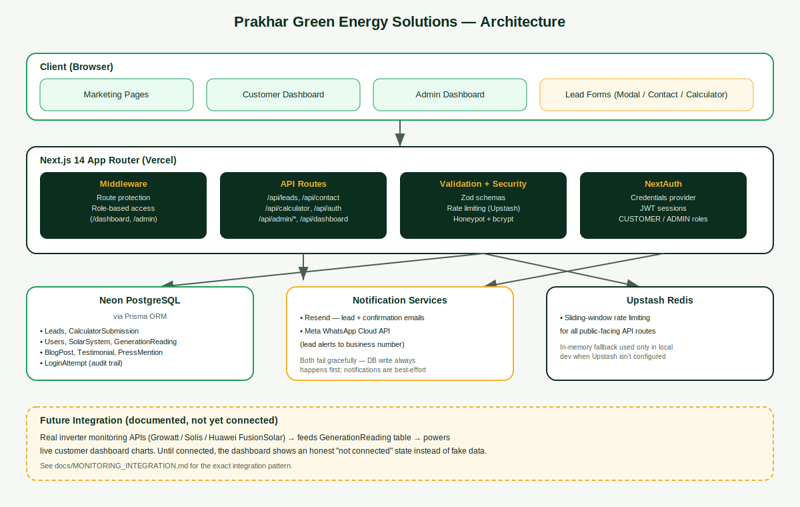

# Prakhar Green Energy Solutions — Official Website

Production-grade website for **Prakhar Green Energy Solutions**, a rooftop
solar installation company based in Lucknow, Uttar Pradesh. Built as a
full-stack Next.js application with real lead capture (email + WhatsApp +
database), a working solar savings calculator, customer monitoring
dashboard, and an admin console — not a static template.



## What's included

- **Marketing site** — Home, Solutions (Rooftop / On-Grid / Off-Grid /
  Hybrid / Commercial / Housing Societies), Cities We Serve, About, Blog,
  FAQ, PrakharShield™, Careers, Contact — content matches the approved
  brand site exactly (copy, business info, design language).
- **Lead capture** — "Schedule a Free Visit" modal and Contact form submit
  to a real API that saves to Postgres, emails your team via Resend, and
  (once configured) sends a WhatsApp alert via Meta's Cloud API. See
  `docs/WHATSAPP_SETUP.md`.
- **Solar savings calculator** — real subsidy/payback math based on
  documented PM Surya Ghar subsidy slabs, not arbitrary numbers. See
  `docs/CALCULATOR_LOGIC.md`.
- **Customer dashboard** (optional login, linked from header) — shows real
  generation/savings data once a customer's system is registered and
  monitoring is connected; shows an honest empty state otherwise (no fake
  numbers). See `docs/MONITORING_INTEGRATION.md`.
- **Admin dashboard** (separate login) — view and manage leads through a
  sales pipeline, publish blog posts.
- **Security** — rate limiting, Zod validation on every input, bcrypt
  password hashing, RBAC, security headers, honeypot spam protection. Full
  breakdown in `docs/SECURITY.md`.

## Tech stack

Next.js 14 (App Router) · TypeScript · Prisma · PostgreSQL (Neon) ·
NextAuth v5 · Tailwind CSS · Upstash Redis (rate limiting) · Resend (email)
· Meta WhatsApp Cloud API · Zod · React Hook Form · Framer Motion · Recharts

## Quick start (local development)

```bash
# 1. Install dependencies
npm install

# 2. Copy environment variables and fill them in
cp .env.example .env.local
# Edit .env.local — at minimum set DATABASE_URL (see docs/DEPLOYMENT.md)

# 3. Push the database schema
npx prisma migrate dev --name init

# 4. Seed an admin account + sample blog post
npm run db:seed

# 5. Generate placeholder images (already included, but regenerable)
node scripts/generate-placeholder-images.js

# 6. Run the dev server
npm run dev
```

Visit `http://localhost:3000`. Admin login at `/admin/login` using the
credentials printed by the seed script.

## Deploying to production

Full step-by-step instructions — Neon, Vercel, Resend, Upstash, custom
domain, first-time admin setup — are in **[`docs/DEPLOYMENT.md`](docs/DEPLOYMENT.md)**.

## Documentation index

| Doc | Covers |
|---|---|
| [`docs/DEPLOYMENT.md`](docs/DEPLOYMENT.md) | Full production deployment walkthrough |
| [`docs/MAINTENANCE.md`](docs/MAINTENANCE.md) | How to make common content changes without touching code logic |
| [`docs/SECURITY.md`](docs/SECURITY.md) | Every security measure implemented and where |
| [`docs/CALCULATOR_LOGIC.md`](docs/CALCULATOR_LOGIC.md) | How the solar savings calculator math works |
| [`docs/MONITORING_INTEGRATION.md`](docs/MONITORING_INTEGRATION.md) | How to connect real inverter APIs to the customer dashboard |
| [`docs/WHATSAPP_SETUP.md`](docs/WHATSAPP_SETUP.md) | Setting up Meta WhatsApp Cloud API for lead notifications |
| [`docs/IMAGE_REPLACEMENT_GUIDE.md`](docs/IMAGE_REPLACEMENT_GUIDE.md) | Which placeholder images to swap and with what |

## Project structure

```
src/
  app/
    (marketing)/        # Public site: home, solutions, blog, about, contact, etc.
    admin/               # Admin login + dashboard (leads, blog management)
    dashboard/           # Customer monitoring dashboard
    api/                 # All backend API routes
  components/
    marketing/           # Header, footer, hero, all homepage sections
    dashboard/           # Shared dashboard components
    ui/                  # Design system primitives (button, input, dialog, etc.)
  lib/
    site-config.ts       # ⭐ Single source of truth for all business info
    solutions-data.ts    # ⭐ Content for every /solutions/[slug] page
    calculator.ts        # Solar savings calculator logic
    auth.ts               # NextAuth configuration
    validations.ts        # All Zod input schemas
    email.ts / whatsapp.ts # Notification services
    rate-limit.ts         # Upstash-backed rate limiting
prisma/
  schema.prisma          # Full data model
  seed.ts                 # Creates admin account + sample content
docs/                     # All documentation referenced above
scripts/                  # Utility scripts (placeholder image generator)
```

Most content edits only require touching `src/lib/site-config.ts` or
`src/lib/solutions-data.ts` — see `docs/MAINTENANCE.md` for specifics.

## Known limitations (by design, not oversight)

- **Placeholder images**: every photo slot uses an on-brand placeholder
  SVG, clearly labeled, rather than fabricated stock-style photography.
  Real photos should be added before launch — see
  `docs/IMAGE_REPLACEMENT_GUIDE.md`.
- **Customer monitoring dashboard**: shows a honest "not connected" state
  until a real inverter API or manual data entry process is wired up — see
  `docs/MONITORING_INTEGRATION.md`. This is intentional: showing fabricated
  generation numbers to a real customer would be dishonest and was
  explicitly avoided.
- **WhatsApp notifications**: code is fully wired, but requires you to
  complete Meta Business verification and template approval — this step
  cannot be automated. Email notifications work immediately without it.

## License

Proprietary — © Prakhar Green Energy Solutions. All rights reserved.
